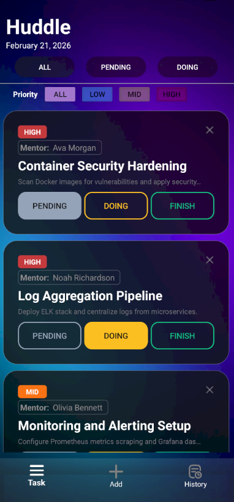
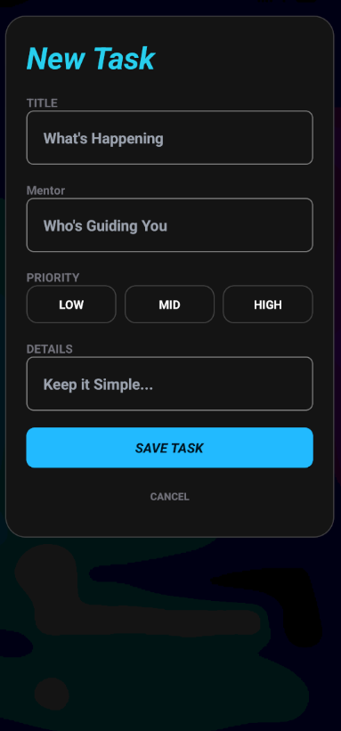
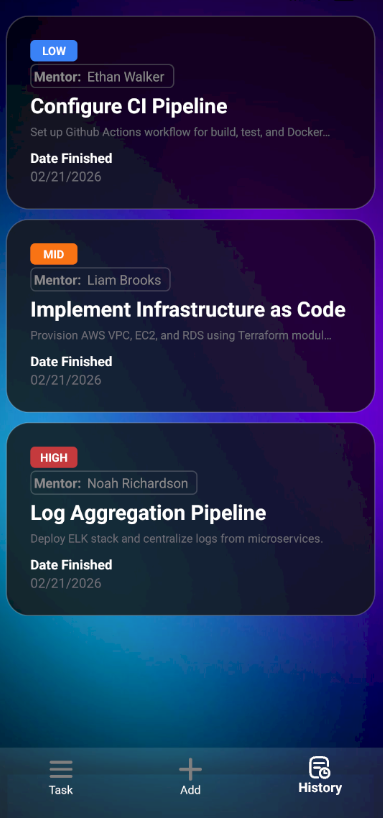

# Huddle

Huddle is a Android task management application.

It allows users to seamlessly track, filter, and complete daily tasks in real-time.

The app uses anonymous authentication to get users working immediately without requiring a lengthy sign-up process.

---

## FEATURES

### **1. Real-Time Task Board**

The **Task Dashboard** is the central hub for activity.
**Pending:** The backlog of tasks ready to be started.
**Doing:** Active focus area for current development.
**Finish:** Completed milestones ready for review.
The app updates in real-time so your progress is always current.

### **2. Filtering**

The **Priority Filter** helps you eliminate distractions.
**Filter by Rank:** Instantly view only **High**, **Mid**, or **Low** priority tasks.

### **3. Deep Context View**

Every task card acts as a gateway to more information.
**Detailed Expansion:** Click any card to see full details.
**Mentor Guidance:** Track who is overseeing the task to ensure accountability.
**Technical Specs:** View specific implementation details without cluttering the main board.

### **4. Historical Tracking**

The **History Page** serves as your long-term project log.
Once a task is marked as finished, it is automatically archived here.

---

## TECHNICAL STACK

* **Language:** **Kotlin**
* **Database:** **Firebase**
* **IDE:** **Android Studio**

---

  
 
